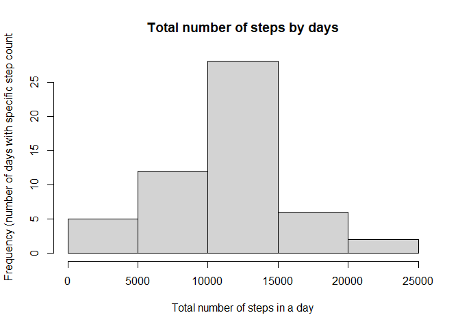
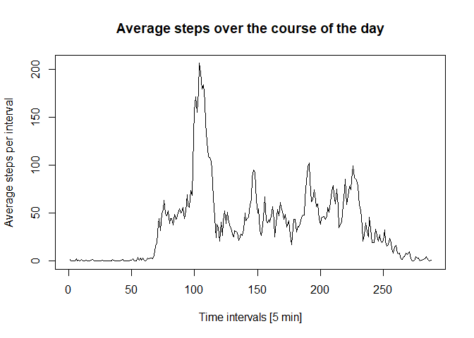
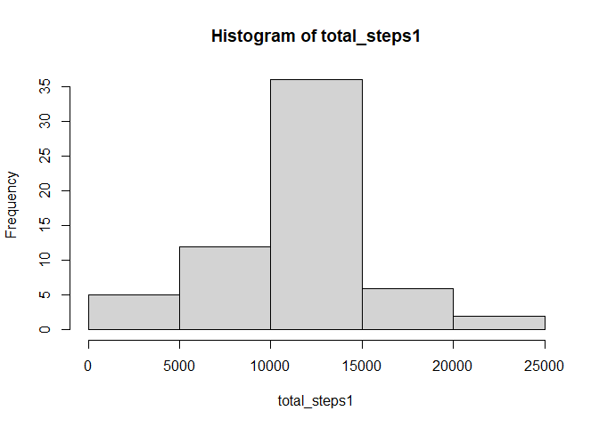
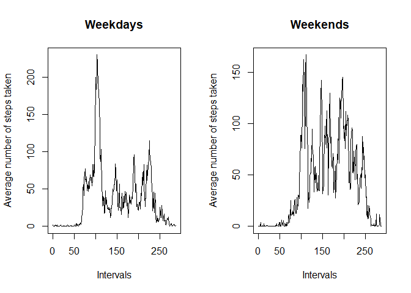

## Loading and preprocessing the data


```r
data <- read.csv("activity.csv")
clean_data <- data[complete.cases(data),]
clean_data$date <- as.Date(clean_data$date)
```


## What is mean total number of steps taken per day?

### 1. Calculate the total number of steps taken per day


```r
total_steps <- tapply(clean_data$steps, clean_data$date, sum)
```

### 2. Make a histogram of the total number of steps taken per day


```r
hist(total_steps, main = "Total number of steps by days", xlab = "Total number of steps in a day", ylab = "Frequency (number of days with specific step count")
```

<!-- -->

### 3. Calculate and report the mean and median of the total number of steps taken per day


```r
mean(total_steps)
```

```
## [1] 10766.19
```

```r
median(total_steps)
```

```
## [1] 10765
```

## What is the average daily activity pattern?

### 1. Make a time series plot of the 5-minute interval (x-axis) and the average number of steps taken, averaged across all days (y-axis)


```r
clean_data$interval <- as.factor(clean_data$interval)
steps_interval <- tapply(clean_data$steps, clean_data$interval, mean)
plot(steps_interval, type = "l", xlab = "Time intervals [5 min]", ylab = "Average steps per interval", main = "Average steps over the course of the day")
```

<!-- -->

### 2. Which 5-minute interval, on average across all the days in the dataset, contains the maximum number of steps?


```r
max(steps_interval)
```

```
## [1] 206.1698
```

The maximum number of steps is 206.1698 which corresponds to the interval at 8:35.

## Imputing missing values

### Calculate and report the total number of missing values in the dataset 


```r
sum(is.na(data))
```

```
## [1] 2304
```

### Devise a strategy for filling in all of the missing values in the dataset. The strategy does not need to be sophisticated. For example, you could use the mean/median for that day, or the mean for that 5-minute interval, etc.

I would use the mean for that time interval as it is more representative of how much people move. As we have seen in the plot that looks of movement throughout the day, people take a lot less steps during the night than during the early morning.

### Create a new dataset that is equal to the original dataset but with the missing data filled in.


```r
for (i in 1:nrow(data)) {
    if(is.na(data$steps[i])) {
      data$steps[i] <- mean(data$steps[data$interval==data$interval[i]], na.rm = TRUE)
  }
}
```

### Make a histogram of the total number of steps taken each day and Calculate and report the mean and median total number of steps taken per day. Do these values differ from the estimates from the first part of the assignment? What is the impact of imputing missing data on the estimates of the total daily number of steps?


```r
total_steps1 <- tapply(data$steps, data$date, sum)
hist(total_steps1)
```

<!-- -->

It differs a little bit but the overall trend stays the same. The total daily number of steps increase slightly.

## Are there differences in activity patterns between weekdays and weekends?

### Create a new factor variable in the dataset with two levels – “weekday” and “weekend” indicating whether a given date is a weekday or weekend day.


```r
data$date <- as.Date(data$date)
data$day <- weekdays(data$date)

v <- character()

for (i in 1:nrow(data)) {
  if(data$day[i] == "Samstag") {
    v <- c(v, "Weekend")
  } else if (data$day[i] == "Sonntag") {
    v <- c(v, "Weekend")
   } else {
    v <- c(v, "Weekday") }
}

data$weekpart <- v
```

### Make a panel plot containing a time series plot (i.e. type = "l") of the 5-minute interval (x-axis) and the average number of steps taken, averaged across all weekday days or weekend days (y-axis). 


```r
par(mfrow=c(1,2))
list_weekdays <- subset(data, data$weekpart == "Weekday")
list_weekends <- subset(data, data$weekpart == "Weekend")
steps_weekdays <- tapply(list_weekdays$steps, list_weekdays$interval, mean)
steps_weekends <- tapply(list_weekends$steps, list_weekends$interval, mean)
plot(steps_weekdays, type = "l", xlab = "Intervals", ylab = "Average number of steps taken", main = "Weekdays")
plot(steps_weekends, type = "l", xlab = "Intervals", ylab = "Average number of steps taken", main = "Weekends")
```

<!-- -->

There is a difference between weekdays and weekends. On weekends, people tend to be more active during the day while on weekdays, the main activity is during mornings and late afternoons, presumably because people go to work then.
